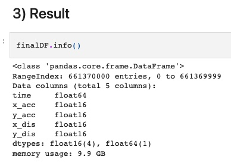
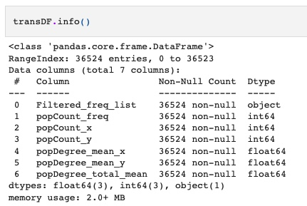
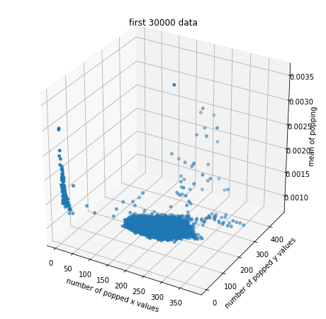
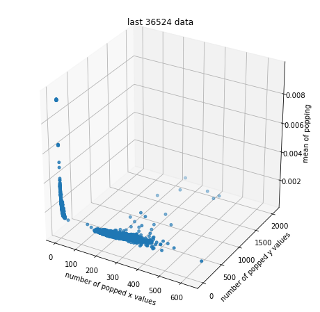
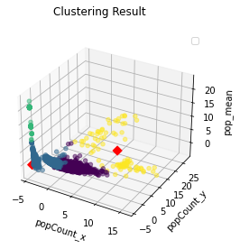
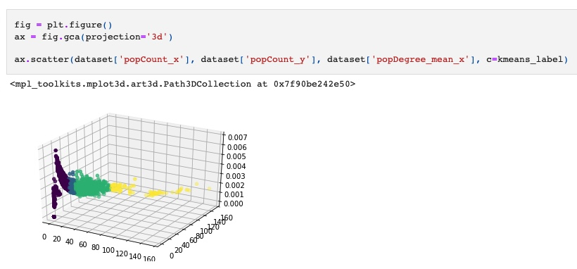
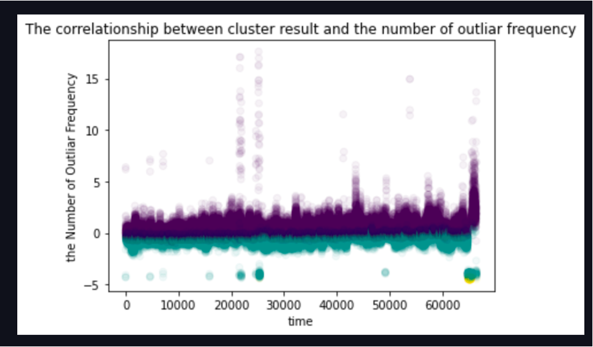
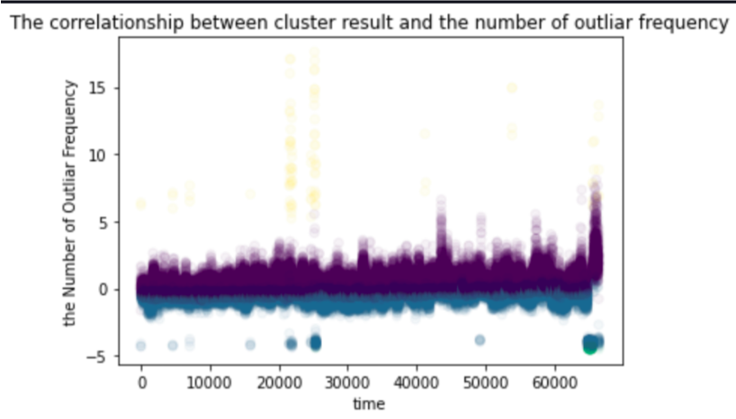
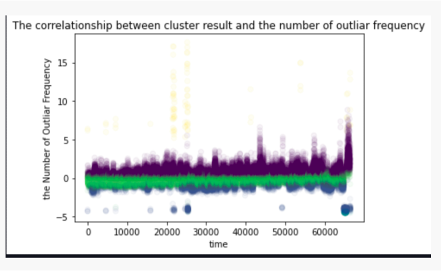

# BigDataAnalysis

Term Project of Big Data Analysis Course

**Analysis of High-speed Spindle Motor Failure using Big Data**

* Introduction

We interested in obtaining some patterns of spindle motor failure, given the data from displacement sensors(x axis, y axis, respectively).

<p align="center">

</p>

* Data
    * sampling time : 1/10000 s (10000 data sampled per 1 sec)
    * the day before failure and the day of failure


# 1. Data Preprocessing

We merged the data which are splitted in many text files and transformed the data into DataFrame.

See '1 Data Merging.ipynb'




## 1) Directly Dealing with 600 Million Data (Failed)

At first, we want to deal with all 660 million data, but it was impossible due to memory.

## 2) FFT

So, we applied Fast Fourier Transform to each 1-sec data.

Since the sampling ratio is 1/10000, the number of data would be 66000.

Also, new dataframe was made, which includes informations such as popped frequencies, the number of popped frequencies, the degree of popping of frequencies.



The 3d plot for the number of popped values in x-axis, the number of popped values in y-axis, and the mean of degree of popped frequencies is as follows





See '2 Data Transformation.ipynb'


# 2. K-means Clustering

We researched some clustering methods such as K-means Clustering, Power Iteration Clustering(PIC), Spectral Clustering.

However, PIC was failed due to memory issues.

So we applied K-means Clustering after normalization. Spectral Clustering could be applied in future work.


## 1) using PySpark(in 2021) and using Scikit-Learn(added in 2022)

Using PySpark and Scikit-Learn Library, we applied K-means Clustering for k=3, k=4, k=5.

The best result was for k=4. ('3. Analysis')

## 2) Plotting

The result using PySpark is as follows.



The result using Scikit-learn is as follows.




# 3. Analysis

## 1) Analysis of Clustering

Applying result cluster as different colors, the relationship between cluster and the number of popped frequency in time domain is as follows.

We marked the time when the failure or anomality occured on the plot if it can be distinguished.

* k=3



As you see, we can't distinguish well between normal and failure/anomality.

* k=4



As you see, We can detect the anomality data(yellow color) and failure data(yellow color and dark purple color)

* k=5



As you see, the lightgreen-colored clutser is redundant.

* Result

As a result, green color shows stable state, yellow color shows anomality state, and yellow color with dark purple shows failure.


```
Project Tree is as follows

BigDataAnalysis
├─ .DS_Store
├─ ._.DS_Store
├─ ._.ipynb_checkpoints
├─ ._Analysis of Clustering.ipynb
├─ ._Data Merging.ipynb
├─ ._Data Transformation.ipynb
├─ ._K-means Clustering with Merged Data.ipynb
├─ ._LABVIEW_FFT.jpg
├─ ._kmeans_clustering_k4.ipynb
├─ ._복사용_랩뷰 캡쳐 화면(45000rpm, 10분당 10초)(spindle1)_210914(파손)_Each Graph.pdf
├─ .ipynb_checkpoints
│  ├─ ._Data Merging-checkpoint.ipynb
│  ├─ ._Data Transformation-checkpoint.ipynb
│  ├─ ._K-means Clustering with Merged Data-checkpoint.ipynb
│  ├─ ._Validation of Clustering-checkpoint.ipynb
│  ├─ Data Merging-checkpoint.ipynb
│  ├─ Data Transformation-checkpoint.ipynb
│  ├─ K-means Clustering with Merged Data-checkpoint.ipynb
│  └─ Validation of Clustering-checkpoint.ipynb
├─ 2022 NewTrial
│  └─ Until_2000Hz.ipynb
├─ Analysis
│  └─ 4 Analysis of Clustering.ipynb
├─ DataExample
│  ├─ LABVIEW_FFT.jpg
│  └─ 복사용_랩뷰 캡쳐 화면(45000rpm, 10분당 10초)(spindle1)_210914(파손)_Each Graph.pdf
├─ DataPreprocessing
│  ├─ 1 Data Merging.ipynb
│  └─ 2 Data Transformation.ipynb
├─ K-meansClustering
│  ├─ 3 K-meansClustering_k4.ipynb
│  └─ K-meansClustering with Merged Data(Memory_ Failed).ipynb
└─ README.md

```