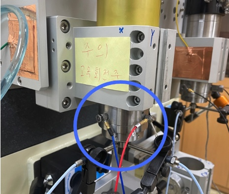

# BigDataAnalysis

Term Project of Big Data Analysis Course

**Analysis of High-speed Spindle Motor Failure using Big Data**

* Introduction

We interested in obtaining some patterns of spindle motor failure, given the data from displacement sensors(x axis, y axis, respectively).

<p aligh="center">

</p>


# 1. Data Preprocessing

## 1) Directly Dealing with 600 Million Data (Failed)

## 2) FFT

# 2. K-means Clustering

## 1) using Pyspark

## 2) using Scikit-Learn

## 3) Plotting

# 3. Analysis

```
Project Tree is as follows

BigDataAnalysis
├─ .DS_Store
├─ ._.DS_Store
├─ ._.ipynb_checkpoints
├─ ._Analysis of Clustering.ipynb
├─ ._Data Merging.ipynb
├─ ._Data Transformation.ipynb
├─ ._K-means Clustering with Merged Data.ipynb
├─ ._LABVIEW_FFT.jpg
├─ ._kmeans_clustering_k4.ipynb
├─ ._복사용_랩뷰 캡쳐 화면(45000rpm, 10분당 10초)(spindle1)_210914(파손)_Each Graph.pdf
├─ .ipynb_checkpoints
│  ├─ ._Data Merging-checkpoint.ipynb
│  ├─ ._Data Transformation-checkpoint.ipynb
│  ├─ ._K-means Clustering with Merged Data-checkpoint.ipynb
│  ├─ ._Validation of Clustering-checkpoint.ipynb
│  ├─ Data Merging-checkpoint.ipynb
│  ├─ Data Transformation-checkpoint.ipynb
│  ├─ K-means Clustering with Merged Data-checkpoint.ipynb
│  └─ Validation of Clustering-checkpoint.ipynb
├─ 2022 NewTrial
│  └─ Until_2000Hz.ipynb
├─ Analysis
│  └─ 4 Analysis of Clustering.ipynb
├─ DataExample
│  ├─ LABVIEW_FFT.jpg
│  └─ 복사용_랩뷰 캡쳐 화면(45000rpm, 10분당 10초)(spindle1)_210914(파손)_Each Graph.pdf
├─ DataPreprocessing
│  ├─ 1 Data Merging.ipynb
│  └─ 2 Data Transformation.ipynb
├─ K-meansClustering
│  ├─ 3 K-meansClustering_k4.ipynb
│  └─ K-meansClustering with Merged Data(Memory_ Failed).ipynb
└─ README.md

```